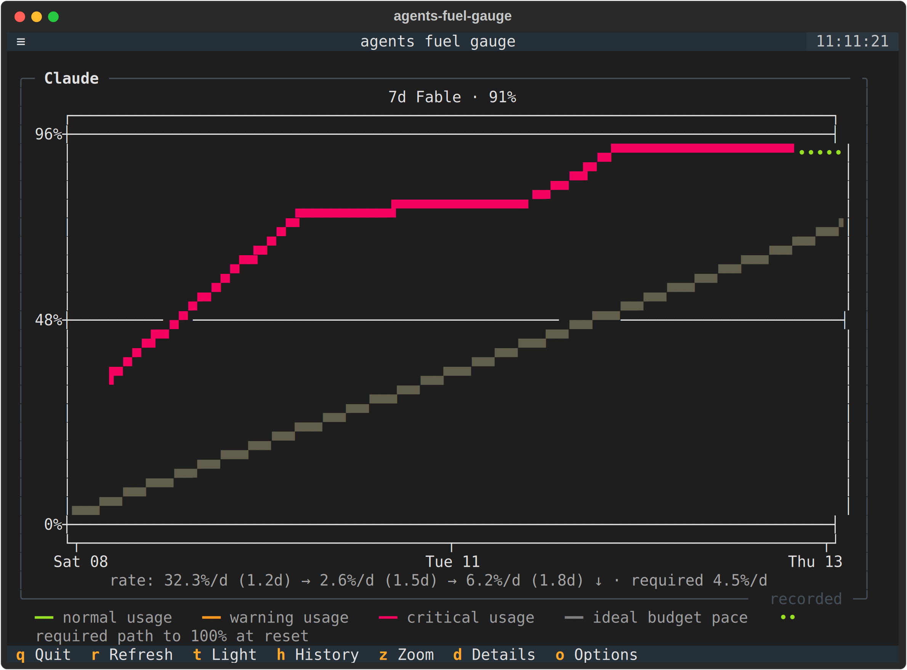
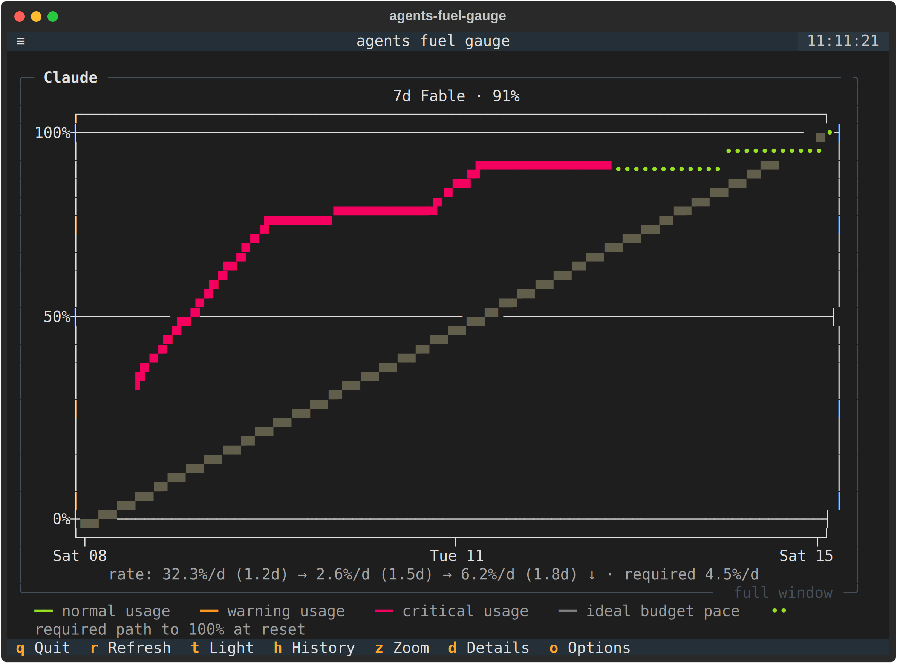
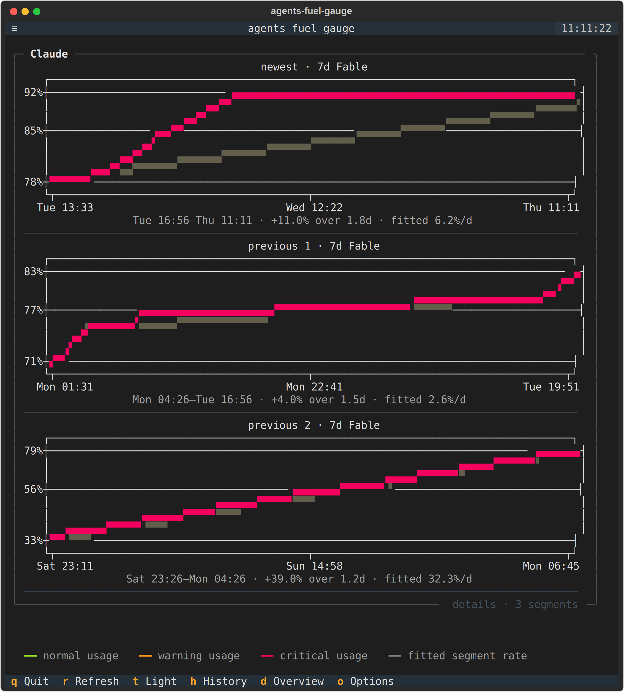

<h1 align="center">agents-fuel-gauge</h1>

<p align="center">
  <em>All your Claude Code and Codex usage limits, on one screen.</em>
</p>

<p align="center">
  
  
  
</p>

<p align="center">
  <picture>
    <source media="(prefers-color-scheme: dark)" srcset="docs/screenshot-dark.png">
    
  </picture>
</p>

<p align="center">
  <sub>Terminal interface built with <a href="https://textual.textualize.io/">Textual</a>.</sub>
</p>

## No sign-in. No API keys. No config.

> **If `claude` or `codex` already works in your terminal, this already works.**
>
> It reads the credentials those CLIs have already written to your machine.
> There is nothing to authorize, nothing to paste, and nothing to set up.
> Install it and run `afg`.

Either CLI alone is enough. The live dashboard only draws panels for CLIs that
are installed, so a Codex-only setup gets one useful panel rather than a second
box explaining Claude. Installed-but-unavailable CLIs stay visible with their
error, because a sign-in or network problem is something you can act on.

## Install

```sh
curl -LsSf https://raw.githubusercontent.com/itsumimario/agents-fuel-gauge/main/install.sh | bash
```

That's it. It brings its own Python toolchain, installs into an isolated
environment, installs AFG's declared runtime dependencies (including Textual
and plotext), and puts `afg` on your `PATH`. No pnpm, sudo, separate dependency
installs, or system-wide packages are required.

Then:

```sh
afg
```

<details>
<summary>Other ways to install</summary>

```sh
git clone https://github.com/itsumimario/agents-fuel-gauge.git
cd agents-fuel-gauge
./install.sh                 # normal
./install.sh --editable      # run from the checkout; edits apply immediately
./install.sh --uninstall     # remove it
```

Or with [uv](https://docs.astral.sh/uv/) directly:

```sh
uv tool install git+https://github.com/itsumimario/agents-fuel-gauge.git
```
</details>

## Why this exists

- **One screen for both providers.** Claude and Codex quotas live in two
  different places and neither shows the other. This shows all of it, live.
- **It shows the limits other tools hide** — including per-model weekly caps,
  which can sit at 91% while the headline number still reads a comfortable 50%.
- **It tells you how much to slow down or speed up**, per meter, not just how
  full the bar is. 91% used is fine with an hour left and a crisis with four
  days left.
- **History makes a course correction visible.** Press `h` to compare the
  actual trace with the on-budget diagonal and the rate required from here.
  Rate chunks summarize stretches of steady percent-tick movement, so a new
  pace stays visible beside the old one. Only the latest chunk gets an arrow:
  older chunks are context, not behavior you can still change. The default
  view zooms to the interval actually recorded; `z` restores the complete quota
  window, while `d` expands the inferred chunks into individually scaled plots.
- **One-shot from the command line.** `afg --check` prints once and exits, for
  scripts, prompts, cron, and CI.
- **A tiny JSON service for anything else.** `afg --json` gives other tools a
  clean, normalised feed — and a rate instruction per meter they can act on.

## Usage

```sh
afg                      # live dashboard
afg --check              # one-shot, plain text
afg --check --pretty     # one-shot, with bars
afg --json               # one-shot, machine-readable
afg --watch --json       # keep emitting, one JSON object per line
afg --demo               # synthetic data, no accounts needed
afg --update             # update to the latest version
```

### The arrow tells you what to do

Every row ends in an instruction, not a status report. The arrow points the way
you should move, and says how far:

| | |
| --- | --- |
| `↓ by 92%` | **slow down.** At this rate the meter runs out before it resets — cut to 8% of it |
| `↑ by 150%` | **speed up.** There is room for two and a half times this rate |
| `on pace` | this rate lasts exactly to the reset |
| `✗ spent` | nothing left until it resets |
| `too new` | the window has barely opened; no rate worth estimating yet |

An arrow only appears where there's a direction to point. The rest are words,
because a glyph you have to look up is a question, not information — and the
`·` and `◦` this replaced were a pixel apart while meaning opposite things
about whether the reading could be trusted.

**Only the tightest meter carries advice.** Meters aren't independent: one
request spends from all of them at once, so a 5-hour window with headroom to
spare cannot license spending that a nearly-empty weekly window forbids.

```
5h all models  ████░░  18%  Sat Aug  8 14:51   1h 01m
7d all models  █████░  88%  Mon Aug 10 13:57    2d 0h  ↓ by 66%
7d Fable       █████░  91%  Mon Aug 10 13:57    2d 0h  ↓ by 75%
```

The 5-hour meter has plenty left and says nothing, because none of it is
yours to spend. Scope decides what a meter can constrain: `all models` governs
everything, while a per-model cap like Fable governs only that model — which is
why it can add a second, tighter instruction without throttling anything else.

The percentage is the *change*, so `↓ by 92%` and "throttle to 8%" are the same
instruction — the first is just readable at a glance. It's measured against
each meter's **average rate so far**, since one reading is all a snapshot gives
you. A `+` (`↑ by 900%+`) means the figure hit its cap and is a floor, not a
measurement.

That number is what makes the whole thing actionable: a bar at 91% tells you
to panic or relax depending on facts that aren't on the screen. `↓ by 92%`
tells you what to actually change.

Each panel shows its own last-updated age, because the two providers are
fetched independently and one can go stale while the other keeps refreshing.
The masked account remains visible after the first refresh; at phone widths the
plan label yields first and the age becomes compact before the account yields.

### Live dashboard

| Key | Action |
| --- | ------ |
| `r` | refresh now |
| `t` | switch to `Light` or `Dark` (the button names the destination) |
| `h` | toggle quota bars/history plots |
| `z` | toggle Recorded/Full history range (shown in history overview only) |
| `d` | switch between Details and Overview (shown in history only) |
| `o` | open `Options` |
| `q` | quit |

Refreshes every 60s (`-i` to change, 15s minimum). A failed refresh never
blanks a panel — the last known numbers stay up behind a warning.
At phone widths the clickable key buttons wrap onto a second row instead of
scrolling off-screen.

#### History at a glance

- **History (`h`)** replaces the quota bars with each provider's tightest
  meter over time. The solid line is observed usage; the gray diagonal is an
  even budget pace; the dotted line is the pace needed from the latest sample
  to reach 100% exactly at reset. The rate readout beneath the plot summarizes
  changes in how quickly usage was rising; only its latest rate gets an advice
  arrow, because older rates are context rather than behavior you can change.
- **Zoom (`z`)** switches the overview between **Recorded**, which enlarges the
  part AFG has actually observed, and **Full**, which restores the entire quota
  window from 0–100%. It changes only the viewport, never the usage data or
  advice.
- **Details (`d`)** turns up to three inferred steady-rate portions into
  separate, newest-first plots. Each portion gets its own scale plus its time
  range, percentage change, duration, and fitted daily rate. Press `d` again
  for **Overview**.

#### Recorded and Full overview

History opens in the phone-friendly **Recorded** range around samples that
actually exist, with a little padding and the percentage scale fitted to the
visible lines. This avoids spending most of the graph on either unrecorded days
before the trace or future days that have not happened. Press `z` for the
0–100%, whole-window **Full** context and again to return to Recorded.

<table>
  <tr>
    <th>Recorded — the useful observed interval</th>
    <th>Full — the complete quota window</th>
  </tr>
  <tr>
    <td></td>
    <td></td>
  </tr>
</table>

#### Details

Press `d` when the overview compresses a meaningful pace change too tightly.
The same rate chunks shown beneath the overview become independently scaled,
vertically stacked plots, so a short correction remains readable on a narrow
screen. If there is not enough movement to infer a segment yet, AFG says so
instead of inventing one. In Details, `z` is hidden because the segment plots
already own their viewports.

<p align="center">
  
</p>

<p align="center"><sub>Recorded, Full, and Details all show the same deterministic synthetic Claude trace; no account history is read.</sub></p>

The graph legend decodes the solid usage trace (green normal, orange warning,
red critical), the dim gray ideal-budget line, and the green dotted path needed
to reach 100% at reset. In Details, the gray line instead marks the fitted rate
for that segment. Pace advice continues to use the whole-window average, so
changing the chart range or mode changes no directive.

### One-shot: `--check`

```console
$ afg --check
claude  5h  all-models           18%  1h01m  -               spare_capacity  2026-08-08T14:52  1h01m  +900%
claude  7d  all-models           88%  2d00h  GOVERNS         slow_down       2026-08-10T13:58  2d0h   -66%
claude  7d  Fable                91%  2d00h  ACTIVE,GOVERNS  slow_down       2026-08-10T13:58  2d0h   -75%
codex   7d  all-models           62%  1d02h  GOVERNS         spare_capacity  2026-08-09T16:50  1d2h   +220%
codex   7d  GPT-5.3-Codex-Spark  12%  6d21h  -               too_early       2026-08-15T11:50  6d21h  -
```

| | Column | |
| --- | --- | --- |
| `$1` | provider | |
| `$2` | window | `5h`, `7d` |
| `$3` | scope | `all-models` or a model name |
| `$4` | used | percent |
| `$5` | resets in | countdown, to the second in the last hour |
| `$6` | flags | `GOVERNS` — this meter is the tightest constraint on the work it covers, so its advice is actionable. `ACTIVE` — the provider says this limit is the one in force. `STALE` — carried over from an earlier poll |
| `$7` | pace verdict | this meter's own reading |
| `$8` | resets at | local time, ISO-ish |
| `$9` | remaining | `18h07m` inside a day, `5d1h` past one |
| `$10` | change | signed: `-92%` means slow down by 92% |

Columns 7 and 10 are always the meter's *own* reading, which is why the 5-hour
row above still shows `+900%` — true of that meter alone, and not something you
can act on. `GOVERNS` is how a script tells the two apart.

Every field is a single whitespace-free token, so awk columns mean what you'd
expect:

```sh
afg --check | awk '$4+0 > 80'                       # anything over 80% used
afg --check | awk '$6 ~ /GOVERNS/'                  # only what constrains you
afg --check | awk '$6 ~ /GOVERNS/ && $10+0 < -50'   # only real throttling
```

Note the difference between columns 4 and 7 in that output: Fable at **91%** is
`on_track` because the week is nearly over, while Codex at **82%** is
`slow_down` because five days remain. The percentage alone would have ranked
them the other way round.

Columns are only ever appended, never inserted, so scripts written against an
older version keep working.

If a CLI is not installed, `--check` emits a distinct status row such as
`claude NOT_INSTALLED ...` instead of pretending a fetch failed. One working
provider is enough for a successful exit; the command exits non-zero when an
installed provider could not be read, or when neither supported CLI is
installed.

Add `--pretty` for the same data with bars, when a human is reading.

### JSON

`afg --json` emits an envelope: **one directive per meter**, plus the full
per-provider detail if you want to look closer. Both providers are normalised
into the same shape, so consumers never need to know which API a number came
from. Every provider record includes `installed`: an absent CLI remains in JSON
with `installed: false`, an explanatory `error`, and no gauges or directives.
That lets an integration distinguish "not used on this machine" from "installed
but temporarily unavailable" without scraping prose.

```json
{
  "at": "2026-08-06T12:11:46.572952+00:00",
  "directives": [
    {
      "provider": "codex",
      "label": "7d all models",
      "scope": "all models",
      "window": "7d",
      "percent": 82.0,
      "severity": "warning",
      "verdict": "slow_down",
      "actionable": true,
      "direction": "down",
      "rateAdjustment": 0.078,
      "changePercent": -92.2,
      "advice": "slow this meter down by 92% — to 8% of its average rate",
      "projectedUsagePercent": 287.0,
      "resetsAt": "2026-08-11T10:05:46+00:00",
      "secondsRemaining": 435239
    }
  ],
  "providers": [ … ]
}
```

#### The directives

| Field | Meaning |
| ----- | ------- |
| `provider`, `label` | which meter this applies to |
| `governs` | **`true` when this meter is the tightest constraint on the work it covers.** A subscriber steering its own rate should filter on this, or use `effectiveRateAdjustment` |
| `effectiveRateAdjustment` | the multiplier that actually applies once every meter covering this work gets a vote — never larger than `rateAdjustment` |
| `heldBy` | the meter overruling this one, when `governs` is false |
| `verdict` | `slow_down` / `on_track` / `spare_capacity` / `exhausted` / `too_early` — this meter's own reading |
| `direction` | `down` / `up` / `hold` — the arrow, as a value |
| `changePercent` | signed change to make, or `null` when no change is called for. `-92.2` = ease off by 92% |
| `rateAdjustment` | the same instruction as a multiplier, for code that scales a rate directly. `0.078` = throttle to 7.8% |
| `actionable` | `false` when the window is too new to judge |
| `projectedUsagePercent` | where you land at reset if nothing changes. Over 100 means you run out early |

**Use `effectiveRateAdjustment`, not `rateAdjustment`,** unless you have a
reason not to. The per-meter figure describes that meter in isolation, and
meters aren't isolated: a 5-hour window reporting `2.5` while the week reports
`0.34` means you may go at `0.34`, not `2.5`. Only the effective figure has
already reconciled them.

**There is deliberately no single combined instruction.** An earlier version
ranked every meter together and emitted one winner with one multiplier. That
was wrong twice over: ranking implies a prediction the data can't support —
`used / elapsed` is an *average since the window opened*, so a meter burned
hard days ago and idle since looks identical to one burning steadily now — and
a lone multiplier reads as advice about your whole workload when it only ever
described one window.

A window that has only just opened reports `too_early`, `actionable: false` and
`rateAdjustment: 1.0` — a safe no-op. Minutes of data divide into a wild ratio,
and throttling on that would be worse than doing nothing.

#### Per-gauge detail

Each provider under `providers[]` carries `installed`, and each gauge under
`providers[].gauges[]` carries `window`, `scope`, `label`,
`percent`, `severity`, `activeLimit`, `resetsAt`, `secondsRemaining`,
`windowSeconds`, and its own `pace` object.

```sh
afg --json | jq -r '.directives[] | select(.governs and .direction == "down")
                    | "\(.provider) \(.label): \(.changePercent)%"'
afg --json | jq -r '.providers[].gauges[] | select(.activeLimit)
                    | "\(.label) \(.percent)%"'
```

### Subscribing

`afg --watch --json` keeps sampling and emits **one JSON object per line**,
flushed immediately — so anything that can read a pipe can subscribe:

```sh
afg --watch --json -i 60 | while read -r line; do
  jq -r '.directives[] | select(.governs and .verdict == "slow_down")
         | "throttle \(.provider)/\(.label) to \(.effectiveRateAdjustment)x"' <<<"$line"
done
```

That's the whole mechanism: no daemon, no socket, no broker.

### Rate limiting

The vendor usage endpoints are themselves rate-limited, and polling them hard
earns a 429 long before your real quota runs out. So readings are cached on
disk and shared between every `afg` process: a status bar polling once a second
still costs one request a minute. A 429 is recorded with its `Retry-After`, and
nothing is attempted until it expires — retrying into a closed door is what
turns one 429 into a stream of them.

```sh
afg --max-age 300     # reuse a reading up to 5 minutes old
afg --no-cache        # always call the API (can earn you a 429)
afg --clear-cache     # drop cached readings and any standing backoff
```

Fresh polls also append one JSONL sample per gauge under
`$XDG_CACHE_HOME/agents-fuel-gauge/history/` (normally
`~/.cache/agents-fuel-gauge/history/`). With `AFG_CACHE_DIR` set, history lives
under `$AFG_CACHE_DIR/history/`. Repeated unchanged values within five minutes
are collapsed, corrupt lines are ignored, and samples older than 14 days are
pruned automatically.

## Updating

```sh
afg --update
```

Pulls the latest version and reinstalls. It refuses to touch a checkout with
uncommitted changes.

## Requirements

|  |  |
| --- | --- |
| **OS** | Linux |
| **Python** | 3.11+ — the installer provisions it for you |
| **Accounts** | Claude Code and/or Codex, already signed in |
| **Terminal** | 256 colours, a monospace font covering `█ ░ ╭ ↑ ↓` |

Quota data exists only for **subscription** logins (Claude Pro/Max, ChatGPT
Plus/Pro). API-key auth has no quota to report; that's detected and explained
rather than failing silently.

<details>
<summary>Non-standard credential locations</summary>

| Variable | Effect |
| -------- | ------ |
| `CLAUDE_CONFIG_DIR` | Claude Code's own config-directory override |
| `CODEX_HOME` | Codex's own home override |
| `AFG_CLAUDE_CREDENTIALS` | full path to the credentials file |
| `AFG_CODEX_AUTH` | full path to the auth file |
</details>

### What it sends, and where

Up to two read-only `GET`s to the installed providers' own usage endpoints,
using tokens already on your machine. A provider whose CLI is absent is never
contacted:

| Provider | Endpoint |
| -------- | -------- |
| Claude | `api.anthropic.com/api/oauth/usage` |
| Codex | `chatgpt.com/backend-api/wham/usage` |

Nothing is sent anywhere else. No telemetry, no server, no third party. The
response cache and local percentage history described above are the only data
written to disk, both under your XDG cache directory. Account emails are
masked and paths render as `~/…`, so screenshots stay shareable.

## Notes

- **Codex doesn't grade its own limits**, so severity is derived from
  thresholds (≥60% warning, ≥85% critical). Claude reports its own. Neither
  gets an "in force" flag invented for it: Anthropic reports one, OpenAI
  doesn't, so no Codex bar claims to be the binding one.
- **Codex identifies windows by duration, not name.** On plans with no 5-hour
  throttle, no 5h bar is drawn because the API doesn't return one.
- **Codex reports a plan family, not a product name.** `pro` and `prolite` are
  ChatGPT **Pro 20x** and **Pro 5x** — two different subscriptions at two
  different prices — so the raw value is mapped back to the name you actually
  pay for. Anything unrecognised is tidied and shown as-is rather than guessed
  into a plan we know.
- **Not every model gets its own bar** — only those with a dedicated sub-cap.
  The rest draw from the shared pool.

## Development

```sh
uv sync
uv run pytest
uv run python scripts/screenshot.py    # regenerate README images from demo data
```

Screenshots are always generated from `--demo`, so no real account data can
end up in the repository.

## Credits

**agents-fuel-gauge** by **ItsumiMario**.

Built with [Textual](https://textual.textualize.io/) for the terminal UI,
[httpx](https://www.python-httpx.org/) for the HTTP client, and
[uv](https://docs.astral.sh/uv/) for packaging and installation.

## License

[MIT](LICENSE) © ItsumiMario

Release notes are kept in [CHANGELOG.md](CHANGELOG.md).
