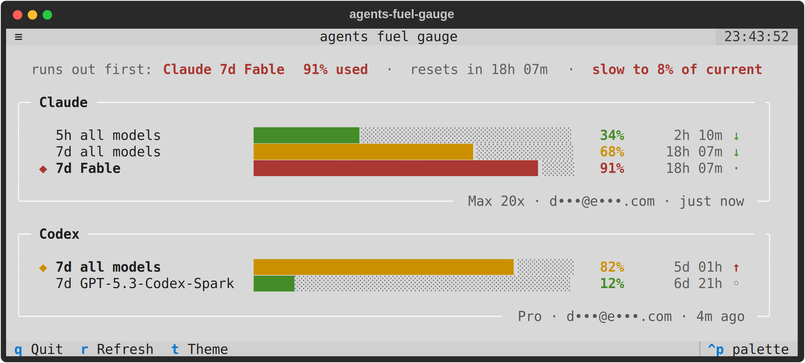

<h1 align="center">agents-fuel-gauge</h1>

<p align="center">
  <em>All your Claude Code and Codex usage limits, on one screen.</em>
</p>

<p align="center">
  
  
  
</p>

<p align="center">
  <picture>
    <source media="(prefers-color-scheme: dark)" srcset="docs/screenshot-dark.png">
    
  </picture>
</p>

<p align="center">
  <sub>Terminal interface built with <a href="https://textual.textualize.io/">Textual</a>.</sub>
</p>

## No sign-in. No API keys. No config.

> **If `claude` or `codex` already works in your terminal, this already works.**
>
> It reads the credentials those CLIs have already written to your machine.
> There is nothing to authorize, nothing to paste, and nothing to set up.
> Install it and run `afg`.

Either CLI alone is enough — you'll just get one panel instead of two.

## Install

```sh
curl -LsSf https://raw.githubusercontent.com/itsumimario/agents-fuel-gauge/main/install.sh | bash
```

That's it. It brings its own Python toolchain, installs into an isolated
environment, and puts `afg` on your `PATH`. No sudo, nothing system-wide.

Then:

```sh
afg
```

<details>
<summary>Other ways to install</summary>

```sh
git clone https://github.com/itsumimario/agents-fuel-gauge.git
cd agents-fuel-gauge
./install.sh                 # normal
./install.sh --editable      # run from the checkout; edits apply immediately
./install.sh --uninstall     # remove it
```

Or with [uv](https://docs.astral.sh/uv/) directly:

```sh
uv tool install git+https://github.com/itsumimario/agents-fuel-gauge.git
```
</details>

## Why this exists

- **One screen for both providers.** Claude and Codex quotas live in two
  different places and neither shows the other. This shows all of it, live.
- **It shows the limits other tools hide** — including per-model weekly caps,
  which can sit at 91% while the headline number still reads a comfortable 50%.
- **It tells you whether you're burning too fast**, not just how full the bar
  is. 91% used is fine with an hour left and a crisis with four days left.
- **One-shot from the command line.** `afg --check` prints once and exits, for
  scripts, prompts, cron, and CI.
- **A tiny JSON service for anything else.** `afg --json` gives other tools a
  clean, normalised feed — and a single rate instruction they can act on.

## Usage

```sh
afg                      # live dashboard
afg --check              # one-shot, plain text
afg --check --pretty     # one-shot, with bars
afg --json               # one-shot, machine-readable
afg --watch --json       # keep emitting, one JSON object per line
afg --demo               # synthetic data, no accounts needed
afg --update             # update to the latest version
```

**`◆` marks the one that runs out first** — the limit that will actually stop
you working. It isn't always the fullest-looking bar.

**Pace marks say whether you're ahead of budget**, which the percentage alone
never tells you:

| | |
| --- | --- |
| `↓` | under budget — you have room |
| `·` | on budget — this rate lasts exactly to the reset |
| `↑` | over budget — you'll run out early at this rate |
| `◦` | window too new to judge |
| `✗` | spent |

Each panel shows its own last-updated age, because the two providers are
fetched independently and one can go stale while the other keeps refreshing.

### Live dashboard

| Key | Action |
| --- | ------ |
| `r` | refresh now |
| `t` | toggle light/dark |
| `q` | quit |

Refreshes every 60s (`-i` to change, 15s minimum). A failed refresh never
blanks a panel — the last known numbers stay up behind a warning.

### One-shot: `--check`

```console
$ afg --check
claude  5h  all-models           34%  2h10m   -      spare_capacity
claude  7d  all-models           68%  18h07m  -      spare_capacity
claude  7d  Fable                91%  18h07m  FIRST  on_track
codex   7d  all-models           82%  5d01h   FIRST  slow_down
codex   7d  GPT-5.3-Codex-Spark  12%  6d21h   -      too_early
```

Columns are `provider · window · scope · used · resets-in · flags · pace`.
Every field is a single whitespace-free token, so awk columns mean what you'd
expect:

```sh
afg --check | awk '$4+0 > 80'          # anything over 80% used
afg --check | awk '$6 ~ /FIRST/'       # only what stops you first
afg --check | awk '$7 == "slow_down"'  # only what you're overspending
```

Note the difference between columns 4 and 7 in that output: Fable at **91%** is
`on_track` because the week is nearly over, while Codex at **82%** is
`slow_down` because five days remain. The percentage alone would have ranked
them the other way round.

Exits non-zero if a provider couldn't be read.

Add `--pretty` for the same data with bars, when a human is reading.

### JSON

`afg --json` emits an envelope: a single **directive** to act on, plus the full
per-provider detail if you want to look closer. Both providers are normalised
into the same shape, so consumers never need to know which API a number came
from.

```json
{
  "at": "2026-08-06T03:41:12.008431+00:00",
  "directive": {
    "verdict": "slow_down",
    "rateAdjustment": 0.051,
    "advice": "slow to 5% of current rate",
    "constraint": {
      "provider": "codex",
      "label": "7d all models",
      "percent": 98.0,
      "severity": "critical",
      "secondsRemaining": 172163
    },
    "projectedUsagePercent": 137.0,
    "exhaustsInSeconds": 8829
  },
  "providers": [ … ]
}
```

#### The directive

The one thing most consumers need. `rateAdjustment` is a plain multiplier —
apply it to your current request rate and you land exactly on empty at reset.

| Field | Meaning |
| ----- | ------- |
| `verdict` | `slow_down` / `on_track` / `spare_capacity` / `exhausted` / `unknown` |
| `rateAdjustment` | multiply your current rate by this. `0.05` = throttle to 5%; `1.9` = room for nearly double |
| `constraint` | which limit this came from — always the one under the most pace pressure |
| `projectedUsagePercent` | where you land at reset if nothing changes. Over 100 means you run out early |
| `exhaustsInSeconds` | how long until empty at the current rate, or `null` if you'd survive |

A window that has only just opened is never chosen as the constraint: minutes
of data divide into a wild ratio, and throttling on that would be worse than
doing nothing. If nothing is judgeable yet, `verdict` is `unknown` and
`rateAdjustment` is `null` — hold your current rate.

#### Per-gauge detail

Each gauge under `providers[].gauges[]` carries `window`, `scope`, `label`,
`percent`, `severity`, `runsOutFirst`, `resetsAt`, `secondsRemaining`,
`windowSeconds`, and its own `pace` object with the same shape as the directive.

```sh
afg --json | jq -r '.directive.rateAdjustment'
afg --json | jq -r '.providers[].gauges[] | select(.runsOutFirst) | "\(.label) \(.percent)%"'
```

### Subscribing

`afg --watch --json` keeps sampling and emits **one JSON object per line**,
flushed immediately — so anything that can read a pipe can subscribe:

```sh
afg --watch --json -i 60 | while read -r line; do
  factor=$(jq -r '.directive.rateAdjustment' <<<"$line")
  echo "adjusting request rate by ${factor}x"
done
```

That's the whole mechanism: no daemon, no socket, no broker.

## Updating

```sh
afg --update
```

Pulls the latest version and reinstalls. It refuses to touch a checkout with
uncommitted changes.

## Requirements

|  |  |
| --- | --- |
| **OS** | Linux |
| **Python** | 3.11+ — the installer provisions it for you |
| **Accounts** | Claude Code and/or Codex, already signed in |
| **Terminal** | 256 colours, a monospace font covering `█ ░ ╭ ◆` |

Quota data exists only for **subscription** logins (Claude Pro/Max, ChatGPT
Plus/Pro). API-key auth has no quota to report; that's detected and explained
rather than failing silently.

<details>
<summary>Non-standard credential locations</summary>

| Variable | Effect |
| -------- | ------ |
| `CLAUDE_CONFIG_DIR` | Claude Code's own config-directory override |
| `CODEX_HOME` | Codex's own home override |
| `AFG_CLAUDE_CREDENTIALS` | full path to the credentials file |
| `AFG_CODEX_AUTH` | full path to the auth file |
</details>

### What it sends, and where

Two read-only `GET`s to the providers' own usage endpoints, using tokens
already on your machine:

| Provider | Endpoint |
| -------- | -------- |
| Claude | `api.anthropic.com/api/oauth/usage` |
| Codex | `chatgpt.com/backend-api/wham/usage` |

Nothing is written, cached, or sent anywhere else. No telemetry, no server, no
third party. Account emails are masked and paths render as `~/…`, so
screenshots stay shareable.

## Notes

- **Codex doesn't grade its own limits**, so severity is derived from
  thresholds (≥60% warning, ≥85% critical), and `◆` goes to the fullest bar.
  Claude reports both directly.
- **Codex identifies windows by duration, not name.** On plans with no 5-hour
  throttle, no 5h bar is drawn because the API doesn't return one.
- **Not every model gets its own bar** — only those with a dedicated sub-cap.
  The rest draw from the shared pool.

## Development

```sh
uv sync
uv run pytest
uv run python scripts/screenshot.py    # regenerate README images from demo data
```

Screenshots are always generated from `--demo`, so no real account data can
end up in the repository.

## Credits

**agents-fuel-gauge** by **ItsumiMario**.

Built with [Textual](https://textual.textualize.io/) for the terminal UI,
[httpx](https://www.python-httpx.org/) for the HTTP client, and
[uv](https://docs.astral.sh/uv/) for packaging and installation.

## License

[MIT](LICENSE) © ItsumiMario
